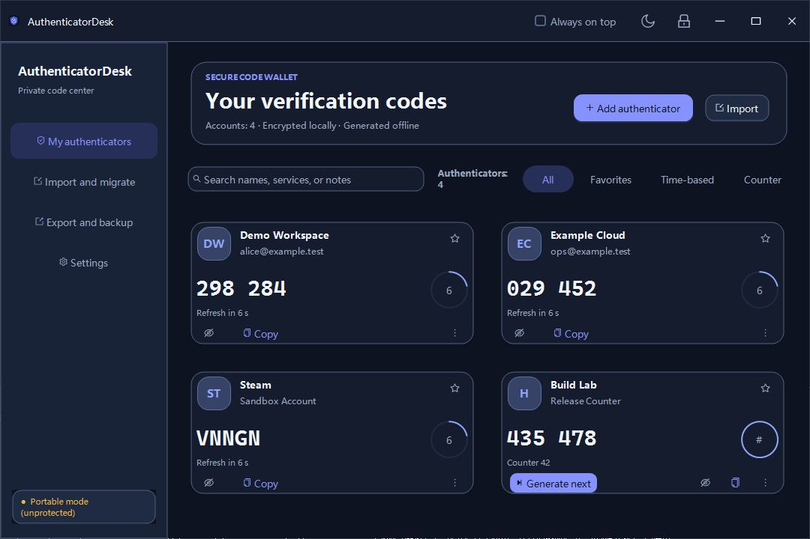
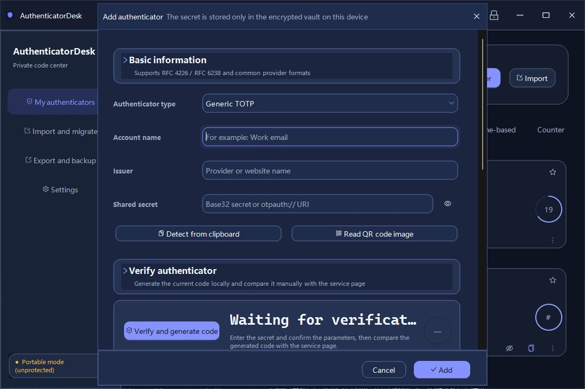
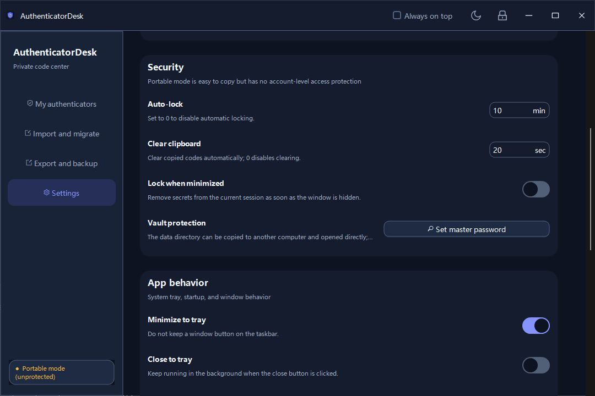

# AuthenticatorDesk

**一款本地优先、面向 Windows 的开源 OTP 验证器。**

[English](README.md) | [简体中文](README.zh-CN.md)

[安全策略](SECURITY.zh-CN.md) · [隐私说明](PRIVACY.zh-CN.md) ·
[参与贡献](CONTRIBUTING.zh-CN.md) · [许可证](LICENSE.txt) ·
[许可证审查](LICENSING-REVIEW.zh-CN.md) ·
[WinAuth 归属声明](WINAUTH-ATTRIBUTION.zh-CN.md)

AuthenticatorDesk 在用户自己的 Windows 设备上管理并生成一次性验证码。它支持
基于标准的 TOTP 和 HOTP、多种面向服务商的配置档、二维码与 `otpauth` 迁移、
加密备份以及 WinAuth 兼容。应用源码中没有实现云账户、遥测客户端、同步服务或
网络时间同步。

> **重要安全提示**
>
> - 新保险库默认使用**便携模式（Portable mode）**。保险库内容经过加密，但加密
>   密钥也保存在同一个 `vault.json` 文件内。此模式便于复制数据目录，但**无法
>   防止获得该文件的人读取保险库**。如果需要文件级访问保护，请设置主密码或启用
>   Windows 账户保护。
> - AuthenticatorDesk **尚未经过独立安全审计**。在将其用于重要账户前，请阅读
>   [安全模型](#安全模型)，并准备经过实际恢复验证的备份。
> - Google、Microsoft、Okta、Guild Wars、Steam、Battle.net 和 Trion 等名称
>   仅表示本地 OTP 配置档及兼容行为，**不代表官方集成、推送批准客户端或服务商
>   背书**。

> **许可证与发布状态**
>
> AuthenticatorDesk 包含改编自 WinAuth 的代码，因此组合作品采用
> [GNU GPL 第 3 版或任何更高版本](LICENSE.txt)。上游作者及修改内容记录在
> [WINAUTH-ATTRIBUTION.zh-CN.md](WINAUTH-ATTRIBUTION.zh-CN.md)。
> 在解决 [LICENSING-REVIEW.zh-CN.md](LICENSING-REVIEW.zh-CN.md)
> 中的 AntdUI/Ms-PL 兼容性问题和应用图标权利前，公开发布仍然**处于阻塞状态**。



## 功能亮点

- 使用 Base32 密钥生成基于标准的 TOTP 和 HOTP。
- 支持 SHA-1、SHA-256、SHA-512，4–10 位验证码，可配置 TOTP 周期和 HOTP
  计数器。
- 支持 Steam 风格的 5 字符代码、Battle.net 配置档及恢复码显示、Trion/Glyph
  兼容配置档。
- 支持搜索、收藏、动态/计数器筛选、备注、强调色和手动排序。
- 支持从二维码图片、剪贴板、`otpauth://` 和 Google Authenticator 迁移数据导入。
- 支持密码加密的原生备份以及 WinAuth 3.5 XML 导入/导出。
- 提供便携模式、Windows 账户保护、主密码三种保险库保护方式。
- 支持自动锁定、最小化时锁定、验证码遮罩和已复制验证码的定时清除。
- 支持全局热键复制、输入或通知显示验证码。
- 提供跟随系统、浅色、深色以及感知 Windows 高对比度的界面。
- 支持系统托盘、启动时最小化、窗口置顶、记忆窗口布局和可选开机启动。
- 内置 10 种语言，并支持经过校验的外置 UTF-8 JSON 语言包。

## 验证器类型

| 类型 | 本地行为 | 重要边界 |
| --- | --- | --- |
| 通用 TOTP | 按 RFC 6238 风格生成动态 OTP，可配置算法、位数、周期及导入的时间偏移 | 不执行网络校时 |
| HOTP | 按 RFC 4226 风格生成计数器 OTP，并提供明确的“生成下一个”操作 | 递增计数器后会立即保存 |
| Google | 带 Google 标识与迁移识别的 TOTP 配置档 | 不连接 Google 账户，也不支持推送批准 |
| Microsoft | 带 Microsoft 标识的 TOTP 配置档 | 不连接 Microsoft 账户，也不支持推送批准 |
| Okta Verify | 带 Okta 标识的 TOTP 配置档 | 不连接 Okta API，也不支持推送批准 |
| Guild Wars 2 | 带 Guild Wars 标识的 TOTP 配置档 | 与 ArenaNet 无隶属关系 |
| Steam Guard | 生成 Steam 风格的 5 字符代码 | 为兼容迁移而保留部分 Steam 元数据，不管理 Steam 会话 |
| Battle.net | 默认 8 位代码；具备所需 serial 和 secret 时可显示本地恢复码 | 服务商行为可能变化，仍应保留官方恢复方式 |
| Trion / Glyph | 生成 Trion 风格的 6 位代码 | 仅为兼容配置档 |

服务商预设只应用已知的本地参数，并保留部分迁移元数据。它们不会向服务商注册
账户、批准登录请求、同步令牌，也不能代替服务商自己的账户恢复方式。

## 仪表盘与条目编辑器

仪表盘会在本地刷新可见的动态验证码和倒计时。用户可以按账户名、发行方或备注
搜索，按收藏或 OTP 类型筛选，调整顺序，以及编辑、导出和删除条目。HOTP 卡片
会显示当前计数器，并提供明确的下一码操作。

条目编辑器支持：

- 账户名、发行方、共享密钥和验证器配置档；
- SHA 算法、验证码位数、刷新周期和 HOTP 计数器；
- serial、device ID、保留的 Steam 数据等服务商字段；
- 备注、收藏状态、强调色、验证码遮罩偏好和热键；
- 从剪贴板或磁盘加载 Base32 密钥、`otpauth` URI 或二维码图片；
- 保存前在本地预览验证码，以便与服务页面进行人工比对。



## 导入与导出兼容性

| 格式或来源 | 导入 | 导出 | 说明 |
| --- | :---: | :---: | --- |
| AuthenticatorDesk `.authdesk` 备份 | 是 | 是 | 密码加密的验证器条目备份，不包含应用设置 |
| 未保护的 WinAuth 3.5 XML | 是 | 是 | 明文文件包含可复用的共享密钥 |
| 密码保护的 WinAuth 3.5 XML | 是 | 是 | 使用旧式兼容加密；新建安全备份应优先使用 `.authdesk` |
| WinAuth Windows 用户/计算机保护 | 取决于上下文 | 否 | 只有 Windows 能解开原 DPAPI 保护层时才能导入 |
| WinAuth 单条目密码 | 是 | 否 | 导入时可分别提示每个受保护条目的密码 |
| WinAuth YubiKey 槽位保护 | 否 | 否 | 未实现所需 YubiKey 流程，因此会明确拒绝 |
| `otpauth://totp` 与 `otpauth://hotp` | 是 | 是 | 支持常见字段和 AuthenticatorDesk 服务商扩展 |
| Google Authenticator `otpauth-migration://` | 是 | 否 | 可导入单个 payload 中的账户，不自动拼接多张分批二维码 |
| 二维码图片 | 是 | 是 | 可读取图片文件或剪贴板图片，不支持摄像头采集 |
| Base32 密钥 | 是 | 不适用 | 可在编辑器中粘贴或从剪贴板加载 |
| OTP URI 明文列表 | 是 | 是 | 每一条导出的 URI 都包含对应共享密钥 |

二维码输入支持 PNG、JPEG、BMP 和 GIF。文本导入可以包含多行 `otpauth` URI。
从主界面导入时，重复项按“验证器类型 + 规范化密钥”判断；如果两个账户类型和
密钥相同，即使名称不同也会被视为重复项。

WinAuth 兼容层会保留部分旧字段，包括 skin 名称、Steam 数据和高级热键脚本文本。
AuthenticatorDesk 不执行 WinAuth 高级脚本。WinAuth 应用设置的迁移也有意保持
有限：会考虑托盘和 Windows 启动偏好，而本地窗口置顶与窗口布局仍由
AuthenticatorDesk 自己管理。

> **包含密钥的导出**
>
> 二维码、复制的 `otpauth` URI、URI 文本导出和未保护的 WinAuth XML 都可以
> 重建验证器。应像保护原始注册密钥一样保护这些输出。

## 安全模型

所有保险库模式都使用 AES-256-GCM 加密序列化后的保险库内容，并采用随机 96 位
nonce、128 位认证标签和带版本的附加认证数据。实际保护能力取决于 256 位保险库
密钥的保护方式：

| 模式 | 密钥保护 | 可移植性 | 能抵御的情况 |
| --- | --- | --- | --- |
| **便携模式**（默认） | 随机保险库密钥与密文一起保存在 `vault.json` envelope 中 | 可直接复制并打开数据目录 | 可避免意外明文暴露并检测篡改，**不能抵御保险库文件被窃取** |
| **Windows 账户保护** | 使用当前用户的 Windows DPAPI 保护随机保险库密钥 | 通常绑定到创建保护的 Windows 用户上下文 | 没有相应 DPAPI 上下文时对离线副本的读取 |
| **主密码** | 使用 PBKDF2-HMAC-SHA-256、600,000 次迭代和 128 位随机 salt 派生 AES 密钥 | 可凭密码在另一台兼容 Windows 系统上打开 | 离线读取难度取决于密码强度及其保密性 |

应用没有密码重置或恢复密钥机制。忘记主密码后，应用无法恢复相应的加密保险库。

### 原生加密备份

`.authdesk` 格式使用 PBKDF2-HMAC-SHA-256（600,000 次迭代）和 AES-256-GCM。
它包含验证器条目副本及服务商元数据，但不包含应用设置。请使用强且唯一的备份
密码，并实际执行一次导入测试后再将备份视为可靠。

为了与 WinAuth 互操作，密码保护的 WinAuth 导出使用 WinAuth 旧式 Blowfish
格式。它应被视为兼容路径，而不是原生加密备份的现代替代品。

### 锁定与剪贴板行为

- 手动锁定会先保存保险库、注销全局热键、尝试清除仍未变化的已复制验证码、
  丢弃会话内密钥材料，并替换当前条目集合。
- 自动锁定依据本应用收到的键盘和鼠标消息，不等同于 Windows 全局空闲检测。
- 只有通过仪表盘或“复制”热键复制的验证码会使用可配置的清除计时器。共享密钥、
  恢复码和复制的 OTP URI 使用各自对话框的普通剪贴板操作，**不会**被该计时器
  自动清除。
- 托管 .NET 字符串无法保证立即从进程内存中抹除。实现会在可行处清零敏感字节
  数组，但不声称具备安全内存保证。
- 当前名为“每次显示前确认”的单条目选项只会遮罩卡片，直到用户选择显示；它
  不会再次请求主密码或 Windows 身份验证。复制验证码同样不会执行单条目重新
  认证。



### 文件与恢复残留

正常保存会使用临时文件替换，并保留前一份加密的 `vault.json.bak`。应用不会自动
恢复这些残留文件。更改数据目录的行为是复制并切换到新的保险库，不会删除旧
保险库。停用设备或目录时，应同时检查新旧位置和所有 `.bak` 文件。

对于安全敏感用途，请自行审查源码和威胁模型，使用主密码或 Windows 账户保护，
限制文件系统访问，保留加密备份，并在目标 Windows 环境中验证实际行为。使用前
请阅读完整的[安全模型](docs/SECURITY-MODEL.zh-CN.md)及
[安全限制](#安全限制)。

## 数据位置与可移植性

AuthenticatorDesk 优先采用便携式目录结构，而不是以安装器为中心：

| 数据 | 默认或回退位置 |
| --- | --- |
| 主保险库 | 可执行文件旁的 `vault.json` |
| 自动保险库备份 | 活动保险库旁的 `vault.json.bak` |
| 错误日志 | 活动数据目录中的 `logs` |
| 程序侧位置文件 | 可执行文件旁的 `AuthenticatorDesk.paths.json` |
| 用户侧位置回退 | `%LocalAppData%\AuthenticatorDesk\locations\<program-id>.json` |
| 界面语言偏好 | `%LocalAppData%\AuthenticatorDesk\ui-preferences.json` |
| 用户语言包 | `%LocalAppData%\AuthenticatorDesk\Languages` |
| 可选开机启动项 | `HKCU\Software\Microsoft\Windows\CurrentVersion\Run` |

新安装会先尝试使用可执行文件目录。如果该目录不可写，应用会要求用户选择数据
目录。当用户选择某个位置作为已有保险库目录时，该位置必须已经包含有效的
`vault.json`。

如果没有优先级更高的保险库或位置文件，应用可能会将旧版
`%LocalAppData%\AuthenticatorDesk\vault.json` 迁移到程序目录。匹配的旧源文件
不会被静默删除，而会存档为
`vault.json.migrated-<timestamp>-<id>.bak`。

即使保险库使用便携模式，界面语言偏好仍是按 Windows 用户保存的。启用开机启动
也会写入当前用户注册表，因此“便携模式”不表示应用在自身目录之外完全不留状态。

当前保险库 envelope 与加密备份格式版本均为 1。保险库内容包含 schema 版本、
条目、设置和时间戳，但项目目前不承诺与未来尚未发布的 schema 版本向前兼容。

## 多语言

应用默认跟随 Windows 当前显示语言，无法匹配时回退到英语。内置语言包括：

- 英语
- 简体中文
- 繁体中文
- 日语
- 韩语
- 德语
- 法语
- 西班牙语
- 巴西葡萄牙语
- 俄语

切换语言后应用会自动重启并应用新语言。外置 UTF-8 JSON 语言包可以放在可执行
文件旁的 `Languages` 目录，或用户语言包目录中。加载器会校验文件大小、locale、
字符串限制和 .NET 格式占位符；无效或缺失的字符串会回退到内嵌英语基线。

详见[中文语言包贡献说明](AuthenticatorDesk.NET/Languages/README.zh-CN.md)、
[英文版说明](AuthenticatorDesk.NET/Languages/README.md)和
[JSON Schema](AuthenticatorDesk.NET/Languages/language-pack.schema.json)。
当前视觉布局面向从左到右书写的语言进行设计和测试，尚不声称完整支持从右到左
布局。

## 安装

### 已发布的二进制文件

仓库提供 GitHub Actions 构建与 ZIP 打包流程，默认生成 Windows x86、x64、ARM64
self-contained 包和需要桌面运行时的 portable 包，详见[发布任务说明](.github/WORKFLOWS.md)。
项目尚未提供安装器、自动更新器或代码签名配置。维护者发布二进制压缩包后：

1. 按该版本说明校验压缩包及其 checksum 或签名。
2. 将完整压缩包解压到可信目录。
3. 保留可执行文件旁的 `Languages` 目录及许可证文件。
4. 启动 `AuthenticatorDesk.exe`。应用不会请求管理员权限。
5. 首次启动时，如果可执行文件目录不可写，请选择可写的数据目录。
6. 添加重要账户前，打开**设置 → 安全**并根据威胁模型选择合适的保护方式。

运行时要求取决于该版本究竟是 framework-dependent 还是 self-contained。应查看
具体版本说明，不要默认其中已经包含 .NET 运行时。

portable 包同样包含 `AuthenticatorDesk.exe`，完整解压后即可双击启动。主 DLL 保持
AnyCPU，EXE 对应构建 SDK 的平台和架构（当前 GitHub Actions 为 Windows x64），
EXE 本身不跨 CPU 通用。也可使用 `Start-AuthenticatorDesk.cmd` 或
`dotnet AuthenticatorDesk.dll` 作为备用启动方式。以上 portable 启动方式均需要
与进程架构对应的 .NET 10 Windows Desktop Runtime。

### CET 启动兼容

针对提示 `Your Windows doesn't fully support CET` 的机器，项目保留 .NET 10，
并通过 `CetCompat=false` 配置普通构建及 framework-dependent、self-contained、
单文件发布生成的 EXE。此配置采用
[微软的 CET 退出方案](https://learn.microsoft.com/en-us/dotnet/core/compatibility/interop/9.0/cet-support)：
应用以放弃 CET 硬件强制堆栈保护换取兼容性，不更改 Windows 安全设置，也不增加
对 Windows 7/8 的支持。

请使用重新生成的程序包，直接启动 `AuthenticatorDesk.exe`。普通用户建议选择与
机器架构匹配的 self-contained 包。CMD 备用启动方式和
`dotnet AuthenticatorDesk.dll` 使用系统的 `dotnet` 宿主，其 CET 行为不受本项目
配置影响。

此配置无法修复 Visual Studio/Roslyn 的 `ServiceHub` 崩溃，包括退出代码
`0x80131506`。如果构建工具异常，请更新 Windows 和 Visual Studio，或在能够正常
构建的机器上发布应用。

### 从源码构建

前置条件：

- 可使用桌面 API 的 Windows；
- [.NET 10 SDK](https://dotnet.microsoft.com/download/dotnet/10.0)；
- 如果不使用源码压缩包，则需要 Git。

在仓库根目录打开 PowerShell：

```powershell
dotnet restore .\AuthenticatorDesk.NET.slnx
dotnet build .\AuthenticatorDesk.NET.slnx -c Release --no-restore
dotnet run --project .\AuthenticatorDesk.NET\AuthenticatorDesk.NET.csproj -c Release
```

项目目标框架为 `net10.0-windows`，使用 Windows Forms，并非跨平台桌面应用。

## 测试

烟雾测试项目覆盖的内容包括：

- Base32 与 RFC OTP 向量；
- `otpauth` 与 Google migration 解析；
- 二维码编码/解码；
- 原生备份和保险库保护模式切换；
- WinAuth fixture、加密层和单条目密码；
- 数据位置选择和旧版迁移；
- 内置语言包完整性及回退；
- 响应式 WinForms 布局、主题、高对比度行为和编辑器校验。

在 Windows 上运行：

```powershell
dotnet test .\AuthenticatorDesk.SmokeTests\AuthenticatorDesk.SmokeTests.csproj `
  -c Release --no-build
```

部分测试会创建 Windows Forms 控件并在 STA 线程中运行。请使用具备相应桌面 API
的 Windows runner；该测试项目不面向跨平台运行。

## 发布

可使用以下命令按 VS 可移植模式生成带 EXE 的 framework-dependent 发布目录：

```powershell
dotnet publish .\AuthenticatorDesk.NET\AuthenticatorDesk.NET.csproj `
  -c Release --self-contained false -p:UseAppHost=true -o .\artifacts\publish
```

self-contained x64 发布示例：

```powershell
dotnet publish .\AuthenticatorDesk.NET\AuthenticatorDesk.NET.csproj `
  -c Release -r win-x64 --self-contained true `
  -o .\artifacts\publish-win-x64
```

上述命令用于单独生成发布目录；完整的测试、打包与 GitHub Release 流程见
[发布任务与 BAT 脚本说明](.github/WORKFLOWS.md)。默认部署模式和架构由
[release-settings.psd1](.github/release-settings.psd1) 管理，发布版本读取
`AuthenticatorDesk.NET/Program.cs` 中的 `AppVersion`。发布开源版本前应：

1. 关闭
   [LICENSING-REVIEW.zh-CN.md](LICENSING-REVIEW.zh-CN.md)
   中的全部阻塞项，包括 AntdUI/Ms-PL 兼容性问题和应用图标权利；
2. 在计划支持的 Windows 环境中构建并运行烟雾测试；
3. 人工验证保险库创建、密码与 DPAPI 模式、导入/导出、托盘行为，以及从上一
   版本升级；
4. 包含外置 `Languages` 文件、[GNU GPL](LICENSE.txt)、
   [WinAuth 归属声明](WINAUTH-ATTRIBUTION.zh-CN.md)和
   [第三方声明](THIRD-PARTY-NOTICES.md)；
5. 让二进制接收者能够以同等、免费方式获取该版本完整的对应源代码，包括项目和
   构建文件，并在二进制下载处清楚标明源代码地址；
6. 说明该版本是 framework-dependent 还是 self-contained，以及目标架构；
7. 发布 checksum，并如实说明签名状态，不暗示不存在的签名。

## 依赖项

运行时 NuGet 依赖保持精简：

| 包 | 项目中的版本 | 用途 | 许可证 |
| --- | ---: | --- | --- |
| AntdUI | 2.4.3 | Windows Forms 界面控件与主题 | 包元数据为 Apache-2.0；内嵌 SVG.NET 部分采用 Ms-PL |
| QRCoder | 1.8.0 | 生成二维码 | MIT |
| ZXing.Net.Bindings.Windows.Compatibility | 0.16.14 | 解码二维码图片 | Apache-2.0 |
| ZXing.Net | 0.16.11，传递依赖 | 条码解码核心 | Apache-2.0 |

AntdUI 2.4.3 还内含使用 Microsoft Public License（Ms-PL）的 SVG.NET 源代码。
自由软件基金会[将 Ms-PL 列为与 GPL
不兼容](https://www.gnu.org/licenses/license-list.html#ms-pl)。由于 AuthenticatorDesk 在
同一进程中链接 AntdUI，这属于发布阻塞项，而不只是署名问题；详见
[LICENSING-REVIEW.zh-CN.md](LICENSING-REVIEW.zh-CN.md)。

WinAuth 兼容层还包含 Bouncy Castle C# API 1.7 Blowfish engine 的一份严格限定
用途的派生代码。归属与适用条款详见
[THIRD-PARTY-NOTICES.md](THIRD-PARTY-NOTICES.md)。

## 仓库结构

```text
AuthenticatorDesk.NET.slnx
├─ AuthenticatorDesk.NET/              Windows Forms 应用
│  ├─ Languages/                       内置及可分发 JSON 语言包
│  ├─ Localization/                    语言包加载、校验与回退
│  ├─ Models/                          保险库、设置与条目模型
│  ├─ Services/                        OTP、加密、存储、QR、热键、WinAuth
│  └─ UI/                              主窗口、卡片、控件与对话框
├─ AuthenticatorDesk.SmokeTests/       xUnit 烟雾与兼容测试
├─ docs/images/                        英文界面截图
├─ THIRD-PARTY-LICENSES/               随发行物提供的许可证全文
├─ LICENSING-REVIEW.md                 发布前合规审查
├─ WINAUTH-ATTRIBUTION.md               上游致谢与修改声明
├─ LICENSE.txt                         项目许可证
└─ THIRD-PARTY-NOTICES.md              第三方归属声明
```

## 安全限制

以下内容是已知边界，不是隐藏的安全保证：

- 便携模式把密钥和密文放在同一文件中，不能抵御保险库文件被窃取。
- 项目尚未经过独立安全审计或正式认证。
- 服务商配置档属于尽力而为的本地兼容；服务商改变格式后可能需要更新。
- 不支持云同步、push MFA、浏览器扩展、移动客户端、摄像头扫码、网络校时、
  自动更新或密码找回。
- Windows 账户保险库及受 DPAPI 保护的 WinAuth 数据依赖可解密它们的 Windows
  用户或计算机上下文。
- 不支持受 YubiKey 保护的 WinAuth 配置。
- 明文和二维码导出会暴露可复用的共享密钥。
- 定时剪贴板清除只适用于已复制的验证码，并不覆盖所有包含密钥的对话框。
- 全局“输入验证码”热键使用 `SendKeys`，会向当时获得焦点的窗口输入内容。使用
  前必须确认目标窗口。
- 关闭“自动刷新”后，当前实现不会在点击“显示”时重新生成卡片上显示的验证码；
  复制验证码时会计算当前值。
- “每次显示前确认”目前只遮罩验证码，不执行主密码或 Windows 重新认证。
- 自动锁定观察 AuthenticatorDesk 内部活动，而不是整个系统的空闲时间。
- 更改数据目录和正常备份行为可能留下额外的加密副本，需要分别管理。
- 当前仓库没有定义安装器、正式 OS 支持矩阵、发布签名流水线或可复现构建声明。

发现疑似安全漏洞时，请遵循[安全策略](SECURITY.zh-CN.md)。不要在公开 issue 中
附加真实 OTP 密钥、保险库、恢复码或未脱敏导出文件。

## 参与贡献

欢迎提交 issue 和 pull request。开始修改前请阅读完整的
[贡献指南](CONTRIBUTING.zh-CN.md)。以下为要点：

1. 保持应用的 Windows 本地优先定位；如需引入网络或遥测行为，应先进行明确的
   设计讨论；
2. 对安全、存储、迁移或格式变更补充或更新烟雾测试；
3. 运行上文的 Release 构建和烟雾测试命令；
4. 新增用户界面文本时使用语言包系统，不要硬编码；
5. 准确记录兼容性和安全取舍。

翻译贡献请先阅读[语言包贡献说明](AuthenticatorDesk.NET/Languages/README.md)。
测试、截图、issue 和 pull request 中都不得使用真实验证器密钥。

除非另有说明，提交到本仓库的贡献采用
[GNU GPL 第 3 版或任何更高版本](LICENSE.txt)。只能提交你有权按兼容条款提供的
材料。

## 许可证

AuthenticatorDesk 包含改编自 WinAuth 的代码，因此完整组合作品采用
[GNU GPL 第 3 版或任何更高版本](LICENSE.txt)。项目保留 Colin Mackie 的版权声明，
标明了修改文件和日期，并在
[WINAUTH-ATTRIBUTION.zh-CN.md](WINAUTH-ATTRIBUTION.zh-CN.md)
中感谢 WinAuth 贡献者。

切换到 GPL 解决了 WinAuth 许可要求，但当前版本仍未通过公开发布审查：
AntdUI/Ms-PL 兼容性问题和应用图标权利仍记录在
[LICENSING-REVIEW.zh-CN.md](LICENSING-REVIEW.zh-CN.md)。
第三方组件继续受 [THIRD-PARTY-NOTICES.md](THIRD-PARTY-NOTICES.md)
汇总的各自条款约束。

产品和服务商名称仅用于说明互操作性。AuthenticatorDesk 与 Google、Microsoft、
Okta、ArenaNet、Valve、Blizzard Entertainment 或 Trion Worlds 没有隶属或
背书关系。
